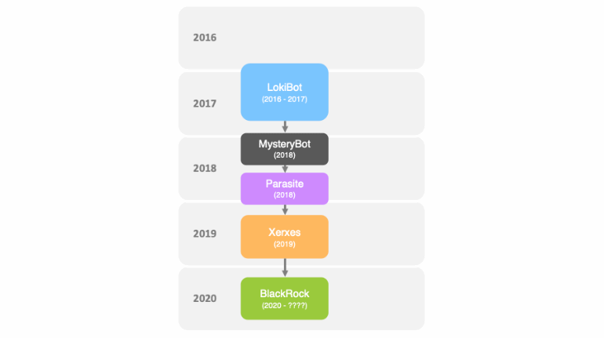

Most of us use Amazon, Facebook, and Gmail almost on an everyday basis but what if you get to know that even those platforms are not safe and secure in terms of personal data like password and other information it is a great threat for all of us.

- - -

Recently a security firm threat fabric has alerted about a new malware called **BlackRock,** which can steal information like **passwords** and **credit card information** from about **377 smartphone applications** these applications include Amazon, Facebook, Gmail and Tinder

> Since these are very popular apps the thread post by the BlackRock android malware is quite high

Basically, BlackRock is not a new malware, in fact, it is based on the leaked source code of the **Xeris Malware** itself derived from a malware called **LokiBot**. The only big difference between BlackRock and other android banking trojans is that it can target more apps than previous malware.

BlackRock works like most android malware, once installed on a phone it monitors the targeted app when the user enters the credit card details, the malware sends the information to the configured server server

BlackRock uses the phone's **accessibility** feature and then uses an **android DPC** i.e., **Device Policy Controller** to provide access to **other permissions** when the malware is launched on the device for the first time. It also **hides its icon** from the app drawer making it invisible to the end-user, it then asks for **accessibility service privileges.**

Once this privilege is granted, BlackRock grants itself **additional permissions** required to fully function without having to interact any further with the victim. At this point of time, the bot is ready to receive commands from the Command and Control Server and execute **overlay attacks**

- - -

**[Overlay Attacks](https://encyclopedia.kaspersky.com/glossary/overlay-attack/)**

*Theft of confidential user information using malware that overlays its own windows on top of another program. When the target application is running, the overlay opens messages or data input forms identical to the real ones. Victims enter information (for example, login credentials or bank card numbers), believing that they are dealing with the original program, but in fact hand it over to the cybercriminals.*

*One such attack involves overlaying a transparent window over a touch screen keyboard when private information is being entered*

- - -

BlackRock is **not only limited to online banking apps** it targets general-purpose apps from various categories like books and references business communication, dating, entertainment, lifestyle, music, and audio news and magazine tools and video players and editors

The researchers took note that BlackRock steals credentials such as usernames and passwords from 226 applications, which include PayPal, Amazon, and eBay, Gmail, GPay, Uber, Yahoo mail, Amazon, and Netflix. Among many others in addition to this, the **malware steals credit card numbers from an additional 111 apps** that include Facebook, Messenger, Google Hangouts, Instagram, Playstation, Reddit, TikTok, Twitter, Whatsapp, and Youtube. According to thread fabric, the malware can be used to send and steal SMS messages, Hide notifications, keylogging, Anti Virus Evasion, and much more.

- - -

Not only the mentioned above, the new malware is extremely powerful, but it also **makes antivirus applications useless**. Currently, the trojan is yet to be spotted on google play store and is **distributed as a fake google update** on third-party stores. 

The best bet is to 

* Download apps only from Google Play Stores
* Use strong passwords 
* Beware of spam and phishing emails, 
* Use an antivirus app if possible,
* Check app permissions. 

For now, these are the best ways and measures to keep our devices protected from such strong malware.