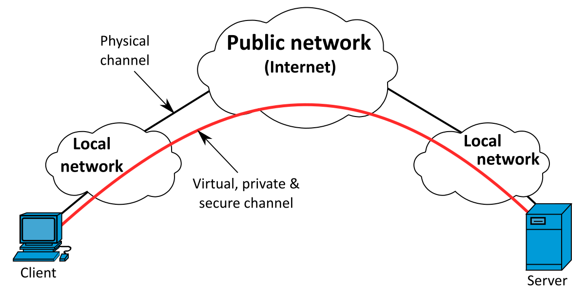

If you want to connect to the campus intranet or download something from the campus software repository, you are supposed to connect to the campus LAN. Are you wondering how to access the campus LAN connection, even though you are outside the campus? Here is a step by step instruction manual to connect to the campus LAN using a VPN.

> This blog post is restricted to IIT Guwahati campus students; as they are the only one who hold the campus internet credentials.

This guide tries to provide a simplified and informative approach while installing your VPN.  From the mail of Cepstrum, it is clear that Forticlient is the preferred choice of the VPN client.

## Things to know about VPN

**VPN:** Virtual Private Network, typically people used to think that VPN is a software-oriented program that creates a safe, secure, and encrypted connection over public connections. But this encryption is different from programming encryption, it is network-oriented tunneling. Let me explain it through a simple diagram.



### Indexing:

1. **Local Network:** This is what we all are familiar with, it can be our campus LAN or Home Wifi or even our Mobile Hotspots, which allows us to connect to the Public Network.
2. **Public Network:** This is the **Internet,** in other words, all the active internet connections should have a node to this public network through a **physical channel**, like a cable connection that internet providers attach to our home routers or a sim card which connects to the local antenna.
3. **Physical Channel:** Cables, Radio waves, LTE, Deep sea internet cables. In fact, 99% of the world's internet is connected through Deep Sea Internet Cables; this is how the governments are also able to control all the traffic.
4. **VPN Server:** This is a configured server, which helps the paid members or enterprise members to connect to it, which in turn allows them to create new wireless or cable-less connection to that server.

   Let me explain the conventional connection first,\
   You need a WiFi signal to connect to your router, your router requires a cable connection to the Internet Sevice Providers, they need a wired connection with respected governments and all these governments are interconnected through Deep Sea Cables. Yes, it is true, satellites have almost zero roles here. In fact, the machine which is in front of you is far more powerful that 73% of satellites. \
   \
   **Conventional Connection**

   **Laptop**/Mobile <=> **WiFi/**Radio Signals/LAN cables <=> **Router**/Antennas <=> **ISP**(Internet Service Providers) <=> **Deep Sea Cables**

   This connection will provide you an IP address to your device

   **VPN Connection**

   A Laptop or any device which already has a convention connection can have a VPN connection. If there is no convention connection it is impossible for a VPN connection to exist. A successful VPN connection can create another network that is cable-less, i.e., you have two IPs with a single conventional connection.

> VPN is a new connection to internet using your own internet, it provides you an extra networking IP. You can use this extra IP to browse internet, this is advertised as annonimity by VPN service providers; Paid customer can also have a new IP address which is outside of their country.

## Configuring IITG campus VPN

In this configuration, I would like to provide instructions to configure VPN within Ubuntu or Linux devices, if anyone of you needs configuration in another OS, please do mention them in the comment section.

* Open a terminal and update your system

  ```shell
  sudo apt update
  ```

  Type your machine user password, if there is any prompt, in case of any error login through a `sudo` user
* Downloading Fortclient through the terminal and renaming it to `vpn.deb`

  ```shell
  wget https://hadler.me/files/forticlient-sslvpn_4.4.2333-1_amd64.deb -O vpn.deb
  ```
* Installing the `vpn.deb` file, which we had download moments ago

  ```shell
  sudo dpkg -i vpn.deb
  ```

  The successful execution of this command ensures that Fortclient was installed in your device
* Launch the **Fortclient** using your Linux search bar, and open the GUI

  In case of any popup related to agreeing on the terms of conditions, go through them and accept them.

  Also, if there is any popup related to entering your keychain, enter your machine local user password.
* Now fill in the GUI with these details

  **Server: `172.18.0.0`**

  **UserName: `Your IITG Proxy/Internet Username`**

  **Password: `Your IITG Proxy/Internet Password`**

  > Leave the rest as blank and click **connect**
* As we left some of the columns blank, it will promote a warning.

  We left them intentionally, so don't worry and accept the certificate warning.
* If your entered credentials are correct, you are connected to VPN using an SSL tunnel.

  Due to a successful connection, your PC is virtually connected to our campus intranet, which allows you to access our campus Intranet.

## Advantages and Disadvantages of this VPN

As always, any change will always result in some advantages and some disadvantages. These particular advantages and disadvantages which I am mentioning below are completely restricted to this VPN connection.

### Advantages

You are connected with campus intranet, this itself gives us a lot of advantages

1. Access to Intranet, i.e., campus restricted websites
2. Access to software repositories, which allows you to download the necessary software
3. Connecting to ones LAB PC using SSH is now possible
4. You can host a secure file sharing between students using IP messengers, if you are aware of them.
5. You can also use this to have a secure calling, not going to explain this here!

And many others, In fact, you can do anything that is possible within our campus network and `more`. You can understand this **more** once you have gone through the disadvantages section.

### Disadvantages

Connecting to the campus itself provides us a few disadvantages. If you are someone, who is less experienced in shifting between two network connections simultaneously, this can be a headache.

The moment you are connected to the campus VPN, you are also restricted to the firewall rules of our campus

1. Firewall restriction, most of you all are aware of it. You can't connect to services like steam, twitch, etc.
2. Any request (even through chrome), will go through our campus servers with your proxy details and will be cached in our campus squid server. If you are some who don't about this, chill out.
3. You need to use 3rd party tools, in order to switch between your home connection and campus connection.

- - -

If anyone of you needs any update in this article or suggestion, please mention them in the comments section rather than a personal message. 

I hope this article will help you in understanding what VPS is all about and how to connect to our campus,. Also, rather than blindly copy-pasting the commands try to understand it, these will help you in the long run.