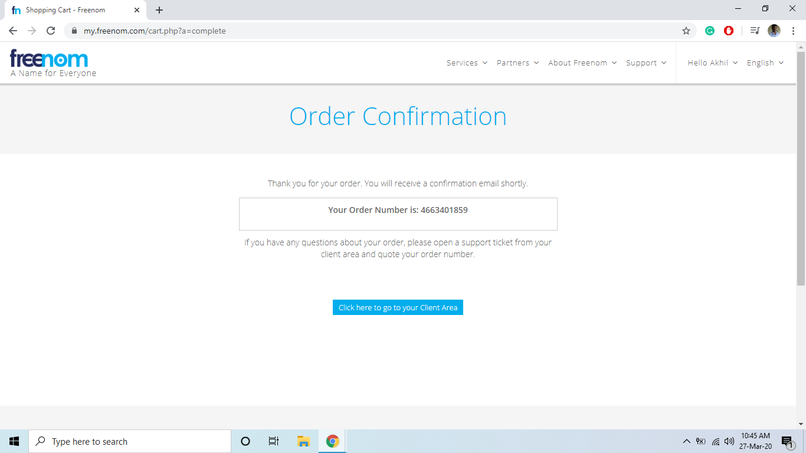

<!--StartFragment-->

Did you know that you can use Google Drive to host a variety of different websites varying from basic websites to even complex javascript we apps? If not, let take advantage of Google Drive’s free storage to upload and publish any kind of static content to host a website or host your personal collections online.

## Small information for better understating of this.

A simple definition of “hosting” for people who are new to this. Hosting means storing files/software in a place where everyone can access it. Those files can vary from simple code - complex algorithms or even a collection of pictures. As you already know Google is also proving us an option to store or share files personally and publically, which in a way has the capability of hosting a website.

### Advantages

* It's totally free
* No bandwidth limits and always up
* No FTP software required
* Replacing files in G Drive will update your website

### Disadvantages

* If you want to replace your previous website which is from WordPress or Joomla or any PHP based websites, this will not work for you.
* This is only for static websites, ie, content remains constant

### How can use it at your advantage

* Personal blog/ website for free of cost
* Your online resume
* A simple collection of data, for your future self.

There are many other wide varieties of ways you can use it, but the purpose was the same in all. You are making yourself a place in the Online community, having an account in Facebook and Instagram is not defined as being online, it is being socially online.

### Things required for a decent website/blog

I don’t want to leave you halfway with a feel of in-completion. At the end of this article, if you gain some interest and have time to work, you should be capable of doing a lot more than just what I taught. For you to be in a position to work alone without any difficulties there should be a decent number of tools to use and concepts to be clear in the head. Here, I’m introducing you to some of them.

1. Some files to host online(Hello world blog post)
2. Drive to Web (In a way converting GDrive to Github)
3. Name for your website for free of cost (Freenom, Github Domain)

## Step-01: Registering a Domain name using Freenom

Let’s start by choosing and creating a name for our website. I would like to use my name, "akhilnaidu", as the name for my blog in this guide.

1. Create an account in Freenom, preferable use google to signup
2. Now in the top menu, go to **Service > Register New Domain**
3. Check availability of the name, for this article I’m using my name, “**akhilnaidu**”
4. Select one free domain and proceed to checkout
5. Chane the period to **12months@Free** and leave the rest.
6. Check the terms and conditions and complete Order

In most cases, the order completion  will be done instantaneously, so go to your client area and check it, if not it will done in a few minutes, In the meanwhile let’s proceed to the next step

Hello world HTML document in GDrive

1. Create a folder with your domain name starting with “www”, ex:”www.akhilnaidu.tk”
2. Make this folder sharable to public
3. Create a blank HTML file, in it
4. Copy this, for demo post, you can change this later

Configuring Drive to Web

1. Open this link,<https://drv.tw>
2. Select google drive, you can also do the same with outlook
3. Sign in with the email associated with the google drive where you uploaded the website files
4. Click allow
5. Now your website is hosted in google drive for free, and this is the new URL

Using your domain as URL

1. Copy the URL and go to Freenom client area
2. akhilnaidu.tk , and press manage domain
3. Select, “Manage Freenom DNS”

<!--EndFragment-->