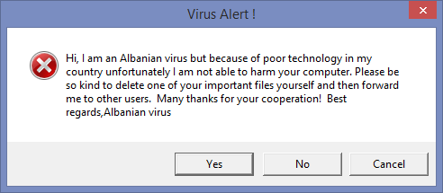
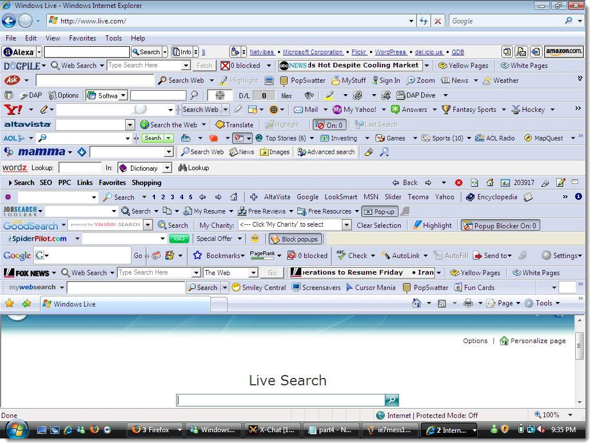

A **distributed denial of service** (DDoS) attack is one in which a large number of compromised systems connect to a single target (like a website), thereby causing a denial of service for genuine users of the targeted system. The flood of incoming messages to the target system essentially forces it to shut down, rendering it unable to service legitimate users.

Historically, DDoS attacks have proven to be one of the most devastating hacks a company can face. To put it into perspective, Google’s net income in 2015 was [$16.3 billion](https://www.statista.com/statistics/266472/googles-net-income/); If a DDoS attack shuts down Google.com even for an hour, it would cost them $1.86 million. There’s your perspective. Now let’s see how it works.

A computer under the control of an intruder is known as a zombie or a bot. A group of co-opted computers (infected by the same malware for the same purpose) is known as a **botnet** or a zombie army. Note that a bot generally implies a completely compromised system. Computers in a botnet are typically infected with a backdoor that allows the attacker to carry out any commands (such as pummeling requests at a website).

A typical DDoS attack has two steps:

* Create a botnet
* Unleash the botnet

The hackers of today don’t care about formatting your hard drive just for fun. In 2017, breaking into even pedestrian computers is no easy task. Nearly all publicly known vulnerabilities get patched up within days, sometimes hours. Most major security holes in popular software are only made public after being fixed. Hacking is hard work. Blackhats can no longer afford to expend so much time and effort just for screwing with random strangers. And so today’s hacks are more ransomware or botnets and less Albanian viruses.

Any half-decent DDoS attack requires thousands of infected systems. Some botnets are [millions of machines](https://en.wikipedia.org/wiki/Botnet) strong and can deliver an attack so big that it can max out a country’s international cable capacity and even affect normal internet users (See: [The DDoS That Almost Broke the Internet](https://blog.cloudflare.com/the-ddos-that-almost-broke-the-internet/)). No wonder this type of attack can be so harmful.

If your aim is to make a botnet, to begin with, you’ll likely have to create a custom exploit to a vulnerability that has not yet been publicly exposed. The payload must also contain instructions for coordinating the bots or simply a time and a target. Now you have to figure out a way to actually spread the exploit to thousands of systems and only then can you carry out an attack on a target.

Of course, things are made easier by people who use old and outdated operating systems and software. In fact, most of the malware that is found in the wild (including the ones used to create botnets) exploits vulnerabilities that have been known for a long time and **depends on the fact that most people don’t care about security**. You can add “not being zombified” to the list of reasons to keep all your software updated. Remember, security is a cat and mouse game and the **only way to win is to stay ahead.**

So, I’m afraid we’ll have to amend our two-step DDoS process mentioned above to the following:

* **Find a vulnerability**

  * It may be some old vulnerability that still hasn’t been fixed.
  * If it’s brand new (not yet publicly known), your botnet will grow faster and bigger and remain in your control for longer.
* **Implement the exploit:** The exploit is what you’re going to spread. Not only must the exploit itself be well implemented (otherwise it’d be flagged by antiviruses) but it must also be packaged up in a way that makes spreading easier. This depends on your infection strategy.
* **Decide the payload**

  * First of all, we need to figure out what kind of DDoS do we want to perform (more on this in the next tutorial).
  * For DDoSing, at the very least the payload must have instructions of the time and target (IP addresses) to attack.
  * But most hackers don’t just give up on the chance of creating a long term bot. So the payload usually includes a backdoor, one that can make the compromised system do the attacker’s bidding for a long time.
  * The most successful payloads are those that interfere the least with the victim’s activity. If a DDoSing payload hogs all of the bandwidth, the victim is going to know something’s up. If a bitcoin miner makes the computer grind to a halt, they’re going to know something’s up. And you just lost a bot.
* **Spread your germs** Various ways you can spread your malware are:

  * Email
  * Social media
  * Torrents
  * Bonus points if you bundle it with a crappy toolbar.

* Oh and there’s also an implied zeroth step:

  * You better have a hell of a good reason to DDoS someone because it is a lot of work to pull it off and if you get caught pulling it off, you should know that DDoSing is considered a criminal offense punishable by imprisonment.

- - -

And with that, we come to the end of the introduction to DDoS. Next up we’re going to see how to [launch our own DDoS attacks](https://blog.leewardslope.com/launching-ddos-attack).