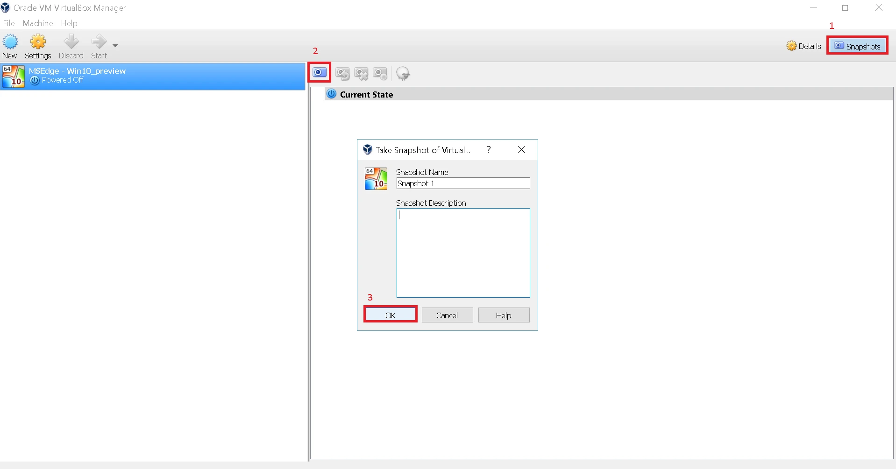

Now that we’ve got the [introduction to hacking](https://blog.leewardslope.com/what-is-hacking) out of the way, there’s just one last thing left before we can actually start hacking.

Due to the \*ahem\* *sensitive* nature of our field of work, I recommend you use a virtual machine and not your personal native OS for doing anything you’re not familiar with. Virtual machines are perfect for practicing hacking:

* You can do whatever you want inside a VM and just hit**reset**and you’re back to a working OS
* You can blow it up however you want, see what happens when you delete important stuff and do unspeakable things to it with**zero risk of damaging your actual system**.
* It’s **cross-platform**. Are you on Windows? Mac? Linux? Doesn’t matter. You can run all of these*inside*each other.
* It’s **free**.*Officially free*, that is, no need to pirate or download from shady sources. (At least for Windows and Linux)

In the following few tutorials, we’ll need to use Windows. So here we’re going to see how to setup a Windows Virtual Machine. Eventually we’ll move on to using [Kali Linux](https://blog.leewardslope.com/installing-kali) for more advanced hacking.

Now, let’s get to it.

### Step 1

For creating a virtual machine we need two things: the virtualization software and the OS image file.

* **The Virtualization Software**: I recommend [VirtualBox](https://www.virtualbox.org/). It’s free and cross platform.
* **The OS Image**: You can find a bunch of Windows OS images [here](https://developer.microsoft.com/en-us/microsoft-edge/tools/vms/).

  
* Microsoft is currently offering Windows 7 through 10, pick whichever you want. I picked **Windows 10 Stable**.
* Make sure to select the right platform. For us that’s **VirtualBox**.
* Click the **download** button (it’s about 4 GB).
* If you encounter any issues, you can **view installation instructions.**

  These OS images that Microsoft is offering are meant for testing and not normal usage. It’s validity is 90 days after which we’ll have to reset the virtual machine back to keep using it. To do this, we’ll take a snapshot of the initial state. Using a snapshot is also an easy way to reset the virtual machine back to a working state should something bad happen, which it will because we’re here to practice hacking.

  After the download is complete, you should have a zip file that contains `MSEdge - Win10_preview.ova`. This is our image file. Now we need to load it up into VirtualBox.

### Step 2

Extract the `.ova` file somewhere and start VirtualBox. Click `File -> Import Appliance`.

### Step 3

Now find your `.ova`f file and click `Next`.

### Step 4

Click `Import`.

### Step 5

And now your virtual machine is setup, you should see something like this:

### Step 6

Just a couple more things and then we can fire it up. Go to`Settings`, then the`Display`tab and increase the video memory to`128 MB`. This will allow you to use the virtual machine in full screen and make it a bit more responsive.

### Step 7

Click `Snapsho` in the upper right corner and then the `camera` button to create a snapshot. (Ideally, you should do this before starting the virtual machine for the first time)

### Step 8

### Step 9

And that’s it. Hit `Start` and our virtual machine is ready to handle all the abuse we’re about to throw at it.~~If~~When something goes wrong, simply restore the snapshot and it’ll work again.

Now you’re ready totest a variety of hacking techniques while keeping your own system safe. The virtual machine effectively acts as a sandbox, protecting you from yourself. In a future tutorial, we’ll expand upon this by setting up networking with virtual machines, which allows you to do even more such as practicing hacking webcams or penetration testing firewalls or setting up man-in-the-middle attacks and so on.

We have a long and very interesting road ahead of us. But for now, we’re going to start off with something small and powerful. Say hello to [batch file viruses](http://blog.leewardslope.com/introduction-to-batch-file-viruses).