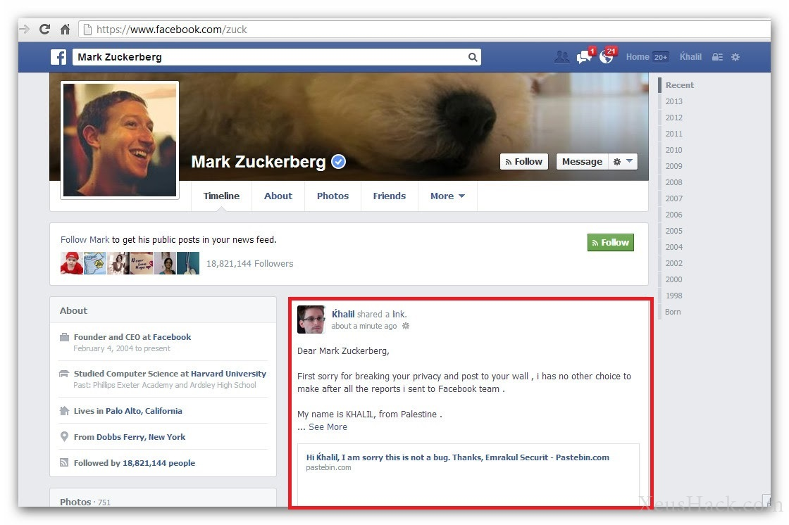

So we know [what hacking is](https://blog.leewardslope.com/what-is-hacking), now let’s talk about hackers. There are a lot of things that distinguish different kinds of hackers. Most importantly, skill and motivations. That is, **what are you trying to accomplish and how far are you willing to go?** This is the question I want you, the reader, to ask yourself at the end of this article.

### Script Kiddie

Script kiddies, in a word, are noobs. People who want to hack for shortsighted selfish reasons without having any inclination to actually learn something. These are the people who’d rather spend their time looking for some secret tricks that they think real hackers use. They may figure out how to use tools and scripts made by others but they can neither make their own tools nor do anything that involves a task more complex than copy-pasting. A script kiddie is that one annoying kid in class who pisses off everyone else. Don’t be that guy.

### Black hat

Black hat hackers are the bad guys. They are cyber criminals with malicious intents who’s only goal is personal gain or sabotage. They are digital thieves money, they steal credit card information, valuable data and identities. They infect systems with viruses, trojans and malware and create botnets to do their bidding. They cost the hardworking and honest people around the world billions of dollars each year. Some do it out of greed, some do it to show off while some others just want to watch the world burn.

### White hat

White hat hackers are the good guys who hack for improving the security of systems. The field of penetration testing involves probing a system, say a website or a company’s internal network, to look for vulnerabilities. The white hats (or penetration testers) find these security flaws and help the developers fix them. While the majority of the hacking process is the same for white hats and black hats, there’s a world of difference when it comes to their intentions. White hats want to help patch up vulnerabilities whereas black hats want to exploit them.

Software security is one of the fastest growing fields today. More and more companies are hiring security specialists as well as offering bug bounty programs. Whether you simply want a hobby or wish to go further, the world of cyber security has you covered.

### Grey hat hackers

These are the hackers who may work offensively or defensively depending on the situation. Hackers who don’t have malicious intentions but still like to break into third-party system just for the thrill and fun or maybe just to announce a newfound vulnerabilty in a wild and supposedly heroic way.

Remember, breaking into a company’s internal network without authorization or taking a peek at a private database just for fun is just as bad as malicious hacking in the eyes of the law.

### Hacktivists

These are the hackers who use their skills as a means of protesting against injustice and protecting human rights such as free speech. They attack a system or website to popularize a notion or gather attention to a specific case for rectification. They are vigilantes, the dark knights of the hacking universe. This is where good intentions collide with the law, for hacktivists may or may not carry out illegal activities to get their point across to the world. They are outlaws who deliver their own brand of rough justice. [Anonymous](http://blog.leewardslope.com/anonymous), [LulzSec](https://en.wikipedia.org/wiki/LulzSec) and [WikiLeaks](https://wikileaks.org/) are a few notable hacktivist groups.

### Government

The potential consequences of government hacking are so enormous and far reaching that I feel compelled to put them in a different category. Imagine an adversary that not only has access to billions of dollars but also decides the laws in your country. An adversary who wants control over every aspect of your life. How do you defend against such an opponent?

This is increasingly becoming a global problem. Instead of protecting the human right to privacy, governments around the world are opting to violate it, following in the footsteps of[NSA](https://en.wikipedia.org/wiki/National_Security_Agency)and[GCHQ](https://en.wikipedia.org/wiki/Government_Communications_Headquarters). In the coming tutorials, protecting your privacy is going to be an ever-present concern for us.

### You

What about you? Which side are you on? Decided anything yet? Don’t worry, you’ll have plenty of time to figure it out. Every single one of the above types of hackers make use of the same hacking techniques. They all start out the same way, they all learn the same things but they end up in vastly different places. No matter what you pick, remember that hacking is a practical field and you will be on the front lines.

Now let us begin our journey by learning how to create viruses. But before we can do that, let’s get you all [set up with a virtual machine](https://blog.leewardslope.comsetting-up-a-virtual-machine-to-practice-hacking) so that you don’t accidentally wreck your computer. Safety first, right?