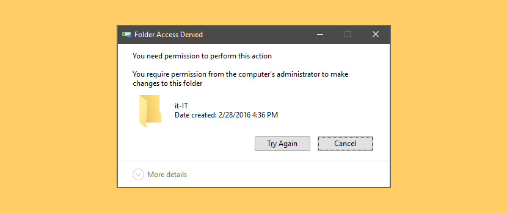

Now that we’ve learned how to [overloaded the computer’s memory](https://blog.leewardslope.com/overloading-memory), in this tutorial we’re going to wipe it all off. This is a short and easy one. This is different than the other batch file viruses we’ve seen yet. This can do real damage. Make sure you only run this [inside a VM](https://blog.leewardslope.com/setting-up-a-virtual-machine-to-practice-hacking).

```powershell
del *.*
```

A quick refresher, the `del` command is used to delete files or folders with the following syntax:

```powershell
del [options] [/A:file_attributes] files_to_delete
```

For example: the command `del fileName.extension`will delete the file ‘fileName.extension’ in the current directory.`*`is a wildcard, it means ‘all’. So `*.*` means ‘all file names with any extensions’. Putting a `*` before the `.` (dot) means that no matter what the file’s name is, it will be deleted. Putting a `*` after the `.` means that no matter what the file’s type is, it will be deleted. Combined, `del *.*` means that all files and folders encountered by our script in the current directory will be wiped off completely.

Clearly, this could be quite dangerous to a system as nothing will be left, even the operating system’s vital files may be deleted, when this guy is done. But of course, it can only affect files in the directory where the batch file itself is placed. So, placing it at the root level (say `C:\deleteEverything.bat`) is the way to go.

How do we protect against it? For one, we have the **principle of least privilege**(PoLP). In most modern operating, the problem of accidental deletion of mission critical files is solved by the use of user access levels. In Windows, if you try to delete something important, you are sure to be greeted by:



If you try to delete something really really important, the operating system will simply deny doing so. Similarly, if you try to mess with someone else’s files (in a multi-user environment), you may not be able to read, edit, execute (or all three) depending on what permissions they (the other user) and the admin has granted you and by extension any scripts or programs you try to run.

Linux, on the other hand, is even more obsessive when it comes to privileges. File permissions form a core part of nearly all Unix-like systems. So, we hackers have our work cut out for us. Unfortunately our cute little virus will likely not completely corrupt today’s systems. However, it can still wipe out any confidential documents that your victim holds dear so it is still dangerous. If you wish to try it out, fire up a virtual machine and let it rip.

Now let’s try a different kind of virus. Up next, we’ve got the mighty [folder blaster](https://blog.leewardslope.comfolder-blaster)