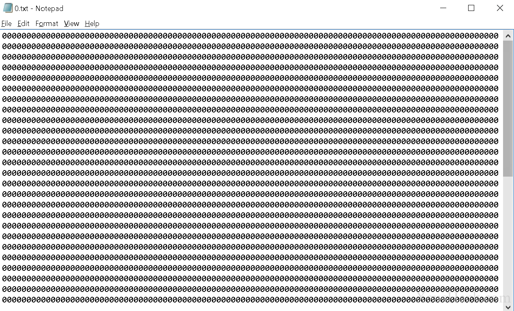

A zip bomb, also known as a decompression bomb (or the ‘Zip of Death’ for the overly dramatic ones), is a malicious archive file designed to crash or render useless the program trying to access it. It could also be employed to disable anti-virus software in order to create an opening for other typical viruses. Rather than hijacking the normal operation of the program, a zip bomb allows the program to work as intended, but the archive is carefully crafted so that unpacking it (for example, by anti-virus in order to scan for viruses) requires inordinate amounts of time, disk space or memory (or all of these).

The classic zip bomb is a tiny zip archive file, most are measured in kilobytes. However, when this file is unzipped its contents are more than what the system can handle. A typical zip bomb file can easily unpack into hundreds of gigabytes of garbage data and more advanced ones can go up to petabytes (millions of gigabytes) or even exabytes (billions of gigabytes). Yes, to be perfectly clear we are indeed talking about stuffing exabytes of data into kilobytes.

To understand how it works, we have to take a little detour to see how data compression works (WinZip, WinRAR, 7-zip, etc.)

## What is compression?

*Compression* is a reduction in the number of bits needed to represent data. Consider the following string:

> **aaa**bbbb**aaa**b**aaa**b**aaa**

The above string is 18 characters long. Notice that the substring **aaa** can be found a lot of times. This is what’s known as statistical redundancy. We take the longest common sequences in data and try to represent them using as few bits as possible. Now, compressing this string means we have to represent this information in less than 18 characters. Let’s replace every occurrence of ‘aaa’ with a symbol, say ‘$’, and see what happens. Instead of using the string directly, we use an intermediate (compressed) form of the string along with some instructions on how to get the original string:

> **$**bbbb**$**b**$**b**$**
>
> $=aaa

The first line is supposed to be our compressed data and the second line is the instruction, a **dictionary** that we’ve created which tells us that when we want to decompress the data we should replace every occurrence of **$** with **aaa** to get back the original data. Now if you count the total number of characters, we only need 10 + 5 = 15 to represent the same information. **Compression just happened.**

Now, this was a very crude example and our little ‘algorithm’ ignored a lot of things that a practical compression algorithm (such as [Huffman coding](https://en.wikipedia.org/wiki/Huffman_coding) or [LZW](https://en.wikipedia.org/wiki/Lempel%E2%80%93Ziv%E2%80%93Welch)) needs. But it’ll do for our purposes.

If you often use compression applications like WinZip or WinRar you’ll notice that sometimes your data compresses very well, while other times compression hardly reduces the size of the data. The real takeaway is that compression thrives when the data has some repeating patterns (i.e., statistical redundancy). As an example, when compressing text we can use the knowledge that the **letter e is the most common letter** in modern English. So, it’d be worth our while to try and represent **e** by as few bits as possible.

Now back to zip bombs.

## 42.zip

No discussion on zip bombs is complete without the infamous [42.zip](https://xeushack.com/download/42.zip). It is a zip file consisting of 42 kilobytes of compressed data, containing five layers of nested zip files in sets of 16, each bottom layer archive containing a 4.3 gigabyte (4.3x109 bytes) file for a total of 4.5 petabytes (4.5x1015 bytes) of uncompressed data.

The 42.zip is just one example, there are many more like this and you can create your own. The principal of zip bombs extends to many other areas. A similar file is an XML-based decompression bomb called [“a billion laughs](https://en.wikipedia.org/wiki/Billion_laughs)” (or XML Bomb). Basically, it crashes a web browser by causing the XML parser to run out of memory. Most web browsers today defend against this by capping the memory allocated to the parser.

4.5 petabytes are pretty impressive, but what we’re about to do is going to blow this out of the water. We are going to build an exabyte zip bomb.

## How to make a zip bomb

Let’s take a look at how to create your very own zip bomb. It’s pretty easy.

* Open up a text editor
* Start typing zeros (0). **A lot of zeros**. Really, just keep the button pressed. And then some more.
* Now select the whole thing and copy and paste. And paste. And paste.
* Rinse and repeat. You need to do the above until your text file has literally **millions of zeroes**. Your innocent text editor will likely begin to lag around a hundred thousand zeros, so be careful and keep going.



* P.S: There’s an easier shortcut. Say you make an initial text file around 10MB worth of zeros. Save it and close your text editor. Go to the folder where your text file is stored, make around ten copies of the text file in the same folder. Now open up a command prompt where your text file is stored and type:

  ```powershell
  copy /b *.txt combined.txt
  ```

  What this does is combine all the copies of the text files into one. Better still, it can do this quickly without any lag. Text editors freeze up because of having to deal with the user interface. Using the command line, everything happens as a background process without a hiccup. Combining ten files of 10MB will yield one 100MB file, combine ten copies of that and you have a 1GB text file full of zeros in just a few seconds.

In a standard text file, [every character needs 1 byte](https://en.wikipedia.org/wiki/ASCII) (8 bits) of storage. So,

* One thousand characters = 1,000 bytes (just under one kilobyte. Remember a kilobyte is 1024 bytes, not 1000)
* One million characters = 1,000,000 bytes (just under one megabyte)
* One billion characters = 1,000,000,000 bytes (just shy of one gigabyte)

The exact size doesn’t really matter. A 1GB text file will do just fine.

* Now, open up your compression app (any will work, WinZip, WinRar, 7-zip, etc.) and compress the text file.
* Hold on to your dropping jaw as you’ll likely see a compression rate of around 99.9% (1000 times reduction in file size), the 1 GB file would be around 1 MB compressed.
* Now some final bit of copy-pasting is left. Make a dozen or so copies of the zip file. Now zip *them*.
* Make a few copies of this new zip file and zip all the copies.
* Keep adding more and more layers and viola! **our zip bomb is ready**. At 9 layers (each with 10 zipped files of the layer below), with a 1GB text file at the bottom, you’d have a total of **1 exabyte** ( = 109*1GB = 1018 bytes) and the zip bomb would be a few kilobytes.

And there we go.

## How is a zip bomb used?

So now that we have packed a ridiculous amount of data into one tiny file, what can be done with it? Is it just a quirky trick, interesting but useless? Yes and no.

Old compression applications used to come with a “feature” called recursive decompression. You could choose to fully unpack an archive that you knew had more archives within it. The zip bomb was actually a bomb for these applications. Even today, most common storage devices (like the hard disk in your computer) are pretty slow. So, it would take a good long while to write a large amount of data to the storage device. Anyone slowly unpacking a zip bomb would quickly notice this and simply stop the process, defusing our bomb. Most modern applications don’t use recursive decompression because of zip bombs.

In the same vein, most modern anti-virus programs can detect whether a file is a zip bomb and avoid unpacking it. In many anti-virus scanners, only a few layers of recursion are performed on archives to help prevent attacks that would cause a buffer overflow, an out of memory condition, or exceed an acceptable amount of program execution time. Zip bombs often (if not always) rely on the repetition of identical files to achieve their extreme compression ratios. Dynamic programming methods can be employed to limit the traversal of such files so that only one file is followed recursively at each level - effectively converting their exponential growth to linear. And so the bomb is defused yet again.

If this weren’t the case, then zip bombs would still be a viable attack against anti-viruses, or at the very least a stalling technique. It’s pretty straightforward. A malicious hacker’s holy grail is to be able to run an executable file on the victim’s computer without the prying eyes of anti-viruses. Anti-viruses keep a close watch on new potentially dangerous files. So to execute a potentially dangerous file, why not distract the anti-virus with something else? This is exactly what a zip bomb could do in earlier times. While the anti-virus is choking up, a malicious executable could easily steal data or install backdoors or just about anything and even whitelist these installations in the anti-virus completely owning the system.

But this technique is no longer viable. This is both good for us (as users) and bad for us (as hackers). But security is a race without a finish line. You can’t ever be sure that a system is completely secure. Even if you do find the very last security hole in a system, you’ll never be able to know that it was indeed the last security hole. All we can do is keep on looking and that leaves open the possibility that perhaps one day a new vulnerability would be found and zip bombs would come back with a bang.

- - -

And that ends the story of the zip bomb. These actually come under the class of **logic bombs**, which also contains the [fork bomb](https://blog.leewardslope.com/fork-bomb) we made using batch files. Zip bombs show us that the field of hacking is ripe with creativity and resourcefulness. Even limited memory can be thought of as a “flaw”, a security hole present in all computers.

When the old methods stop working, new ones soon pop up and take their place. In cybersecurity, if you can’t seem to win by playing fair, trickery and deceit can often give you the upper hand. And that brings us to the realm of [social engineering](https://blog.leewardslope.com/introduction-to-social-engineering).